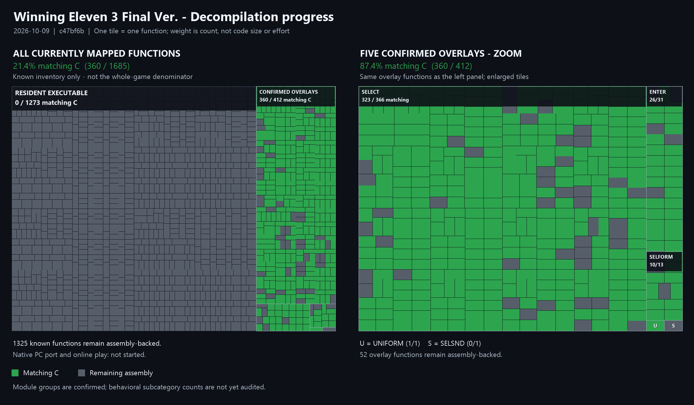

# World Soccer Jikkyou Winning Eleven 3 Final Ver. — Decompilation

Matching decompilation and native-port research for the Japanese PlayStation
release **World Soccer Jikkyou Winning Eleven 3 Final Ver.**, revision 1
(`SLPM_861.62`).

The first goal is a byte-identical reconstruction of the retail executable and
its runtime-loaded modules. The later native-PC target will compile recovered
game logic for the host while replacing PlayStation hardware and PsyQ services.
It will remain separate from the matching target so PC changes cannot silently
break the reference build.

## Status

- Disc layout inspected and the boot executable identified.
- Initial resident section boundaries and overlay candidates documented.
- Reproducible extraction from a locally supplied ZIP/CUE/BIN disc dump is
  available.
- Matching assembly baseline: **established** (1,273 resident functions).
- Confirmed matching overlays: **5** (412 functions, 414,610 exact bytes).
- Decompiled and matching C: **360 functions**.
- Resident frame loop, controller boundary and match dispatchers: **mapped**.
- Native PC target: **not started**.

## Decompilation progress



Treemap snapshot: `c47bf6b` (360 matching C functions).

Green tiles represent matching C; gray tiles remain assembly-backed. Each tile
represents one function. The right panel enlarges the same confirmed overlays
shown on the left; it does not add functions to the total.

The percentages cover the currently mapped inventory, not the whole game or
estimated remaining effort. Groups reflect confirmed modules; behavioral
subcategory counts have not yet been audited.

## Verified target

| Property | Value |
|---|---|
| Boot executable | `SLPM_861.62` |
| SHA-1 | `7e480656a295dced6ec187286773ab897651e995` |
| File size | `882,688` bytes (`0xD7800`) |
| Load address | `0x80010000` |
| Entry point | `0x800156C4` |
| Initial `$gp` | `0x800E6A8C` |

## What is and is not included

This repository does not contain the game, disc images, extracted executables,
BIOS files, media assets, or proprietary SDK and toolchain files. You must
provide your own legally obtained copy of the game and any required proprietary
tools. A fresh clone is not playable and cannot build or verify the game without
those local inputs.

The repository contains reverse-engineering research: configuration, hashes,
disassembly, matching source code, documentation, and original project tooling.
It is not affiliated with or endorsed by Konami. All game names, trademarks,
and copyrighted material belong to their respective owners.

## Repository layout

- `config/` — splat configuration, symbols, relocations and overlay metadata.
- `docs/` — measured disc/layout findings, decisions and contributor workflow.
- `asm/` — generated disassembly and retained handwritten assembly.
- `src/` — matching C, eventually organized by recovered translation unit.
- `include/` — shared types, symbols and function declarations.
- `tools_src/` — original project tooling; MIT licensed separately.
- `tools/` — downloaded compilers and analysis tools; never committed.
- `extracted/` — generated retail inputs from a legally obtained disc; never
  committed.
- `build/` — generated objects, linker output and comparison reports.

The first PCSX-Redux tracing session is described in
`docs/RUNTIME_TRACE.md`. Regenerate its debugger symbol map with:

```powershell
.venv\Scripts\python.exe tools_src\export_pcsx_symbols.py
```

## First setup

From PowerShell in the repository root:

```powershell
py -m venv .venv
.venv\Scripts\python.exe -m pip install -r requirements.txt
.venv\Scripts\python.exe tools_src\extract.py
.venv\Scripts\splat.exe split config\SLPM_861.62.yaml
.venv\Scripts\python.exe tools_src\build.py
```

`build.py` looks for `mipsel-none-elf-{as,ld,objcopy}` in
`tools/mips/bin` or on `PATH`. Alternatively, pass the toolchain directory as
`--bin-dir C:\path\to\mips\bin`.

The overlay build additionally expects the PsyQ 4.5 compiler beneath
`tools/psyq45/BIN` and `maspsx.py` at `tools/maspsx/maspsx.py`. These
third-party tools remain local and are ignored by Git.

Once the local tools are installed, verify the resident executable with:

```powershell
.venv\Scripts\python.exe tools_src\build.py
```

The extractor expects a local ZIP containing a dump made from your legally
obtained disc. The ZIP is not included. It validates the retail executable hash
and writes the boot executable plus suspected code modules beneath `extracted/`.

The splat configuration is an evidence-backed initial split. `build.py`
assembles every generated function without C substitutions, links the image,
and requires the exact retail SHA-1. The current all-assembly build produces
all 882,688 bytes with the verified SHA-1 above.

The five runtime overlays with confirmed live addresses can be verified in one
command:

```powershell
.venv\Scripts\python.exe -B tools_src\build_overlay.py --all
```

`build_overlay.py` automatically compiles any `func_*.c` beneath the matching
`src/overlays/<name>/` directory through its established compiler profile,
maspsx and GNU binutils, substitutes it at the correct address, and then checks
the complete module SHA-1. Established profiles include PsyQ GCC 2.8.1 and a
locally supplied DOS GCC 2.7.2 compiler through DOSBox-X. Each function uses
its individually verified profile. See
[compiler profiles and local setup](docs/COMPILER_PROFILES.md)
for the additional ignored tools and `--dosbox` / `--dos-cc1` options.

For isolated parallel matching assignments and integration rules, see
[the parallel decompilation handoff](docs/PARALLEL_DECOMP.md).

## Two build lanes

1. **Matching PS1 build** — original addresses, original compiler behavior and
   byte-for-byte output. This is the correctness oracle.
2. **Native PC build** — recovered game C plus host implementations for GPU,
   GTE, SPU/CD audio, CD-ROM, movies, input, timing and saves.

Online play belongs to the native lane. Before networking is added, deterministic
record/replay must prove that identical per-frame inputs produce identical game
state checksums.

## Run under PCSX-Redux

The ignored `tools/pcsx-redux/` checkout contains the emulator source and the
ignored `tools/pcsx-redux-bin/` directory contains the verified Windows build
for the same commit. Your locally supplied multi-track disc dump is expanded
under `extracted/disc/`.

Launch the game from PowerShell:

```powershell
powershell -ExecutionPolicy Bypass -File tools_src\run_emulator.ps1
```

This uses the OpenBIOS bundled with PCSX-Redux and writes the emulator log to
`extracted/pcsx-redux.log`. It also enables the local web and GDB interfaces
used by the read-only analysis tools. To use a legally obtained Japanese
retail BIOS:

```powershell
powershell -ExecutionPolicy Bypass -File tools_src\run_emulator.ps1 -Bios C:\path\to\scph5500.bin
```

While the game is running, a second PowerShell window can report game-state
and controller transitions without pausing emulation:

```powershell
python -B tools_src\trace_game_state.py --watch
```

## Licensing

`tools_src/` is MIT licensed; see `tools_src/LICENSE`.

No license is asserted over `asm/` or `src/`, which are derived from a
copyrighted retail executable for reverse-engineering research. Game media and
SDK files are not distributed.
